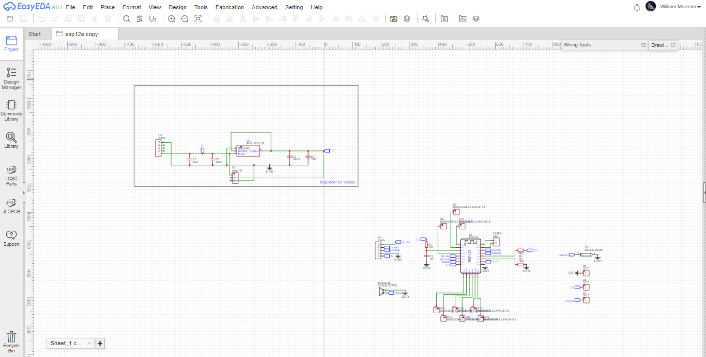
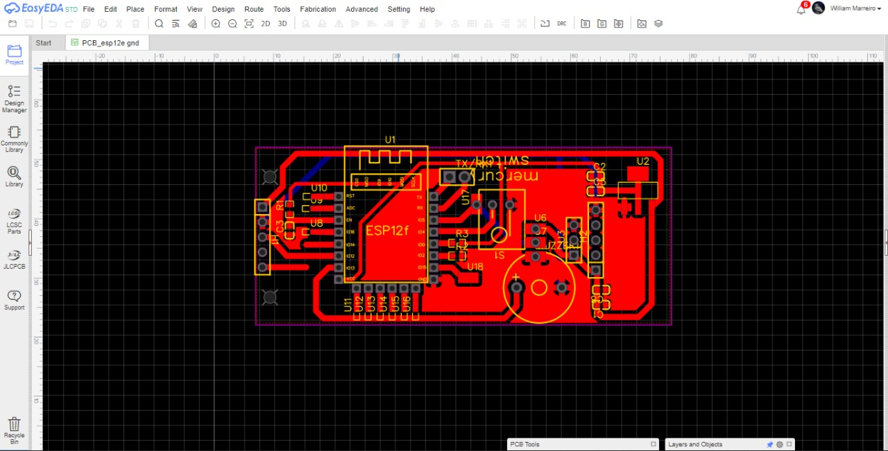
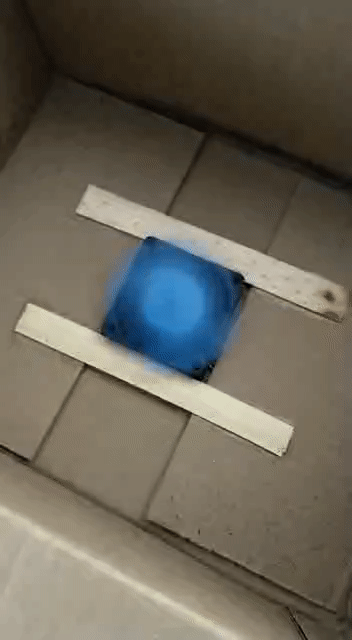
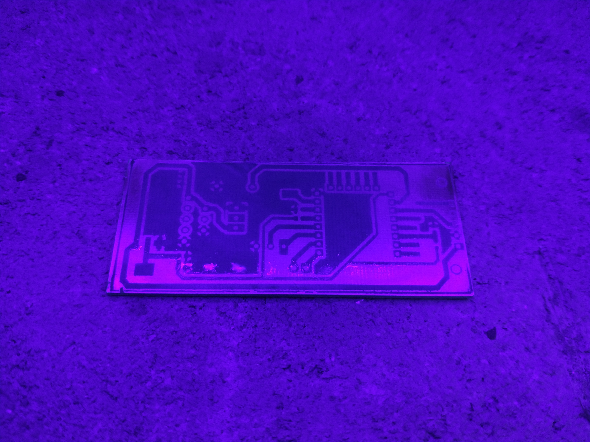
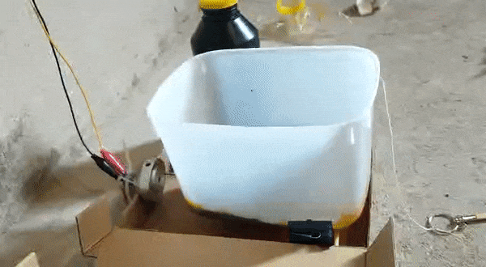
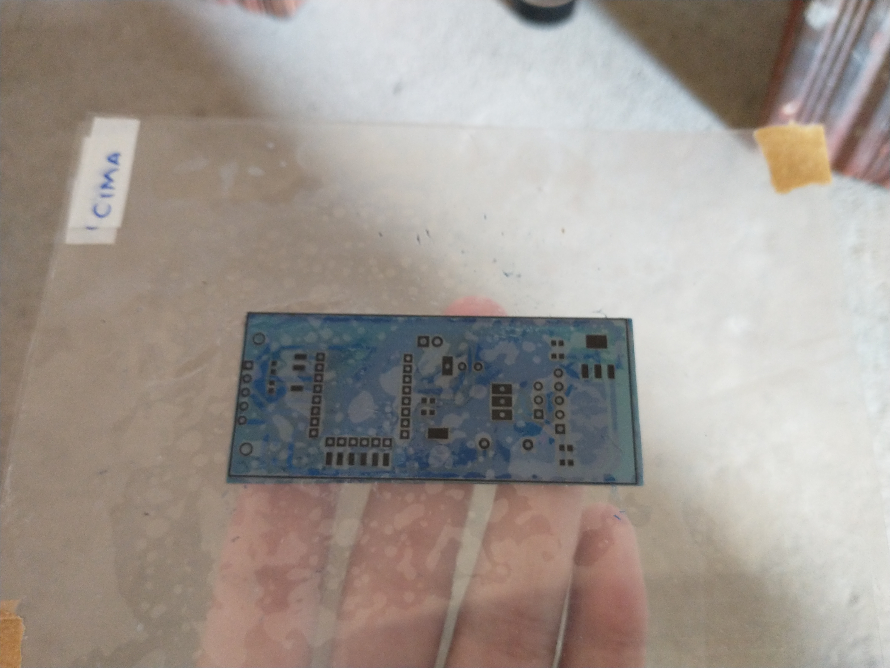

Este projeto foi desenvolvido em 2022, logo no início da minha graduação em Engenharia de Computação. O objetivo deste registro é documentar o passo a passo da construção da PCB, preservando os parágrafos e relatos técnicos escritos originalmente na época.

# Passo a passo da PCI

## 1. Projetando no EasyEDA

---

## 2. Imprimi na folha transparência

---

## 3. Cortei a placa de fenolite e lavando com detergente e bombril

---

## 4. Pintando a placa com a tinta fotossenssível

---

## 5. Centrifugando para dispersar a tinta

---

## 6. Após a secagem (20 horas depois), peguei o circuito impresso na folha transparência e pus sobre a placa. Depois deixei 3 minutos sob a luz UV. Esqueci de tirar foto :(, mas é igualzinho o processo n° 12

---

## 7. Retirei tinta com uma solução de água com barrilha usando bombril e trincha (a tinta que não recebeu a luz UV sai mais facilmente)

---

## 8. Mais 3 minutos sob luz UV para melhorar a fixação da tinta

---

## 9. Coloquei na agitadora com percloreto de ferro

---

## 10. Depois de 15 minutos na agitadora todo o cobre foi corroído

é, tive q dar uns retoques na tinta com caneta permanente (:

---

## 11. Retirei a tinta com bombril e detergente

---

---

## 12. Para evitar a oxidação, pintei novamente, centrifuguei e coloquei na luz UV para apenas as ilhas ficarem à mostra, isso também facilita na hora da solda. (agora sim com fotos, hehe)

---

## 13. Limpei novamente com barrilha (cuidado com o bombril)

---

## Prontinho

---

---

## Conclusão

**O resultado infelizmente não ficou muito bom porque a tinta não estava 100% seca e grudou no papel no passo 12 :[**

**Além disso, resolvi usar bombril no passo 13 e acabou tirando a tinta de onde não devia, tive que retocar com caneta.**

**Por não ter secador de cabelo, eu tinha que esperar a tinta secar de um dia pro outro, acabei levando três dias pra fazer tudo, o que poderia ser feito em 1.**
